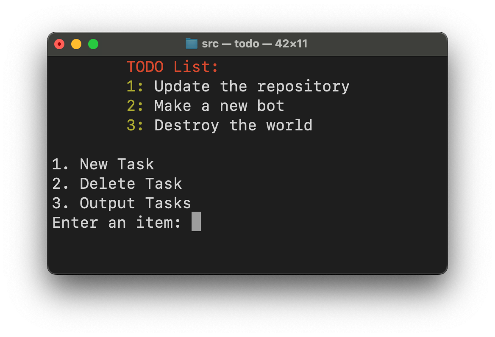
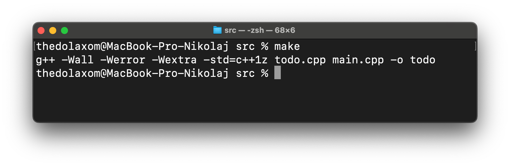

## TODO application written in C++ running in a terminal

## Project structure:

The ``src`` folder contains all the source C++ files of the project. The ``materials`` folder contains everything you need to design the repository. In ``data`` there are text files in which all tasks and logs of the program are recorded in encrypted or not (at the user's choice).

## Completeness of the project

| Functions:              | Readiness: |
|-------------------------|------------|
| Adding new tasks        | ✅          |
| Deleting a task         | ✅          |
| viewing logs            | ♻          |
| Viewing completed tasks | ❌          |
| Sorting by days         | ❌          |
| Settings file           | ❌          |
| Data encryption         | ❌          |

## Building the program:

To build the program, use the **Makefile** and write ``make`` in the terminal *(in src folder)*, or compile manually using the g++.

---

[Termcolor](https://github.com/ikalnytskyi/termcolor) library is used for color output to the terminal!
